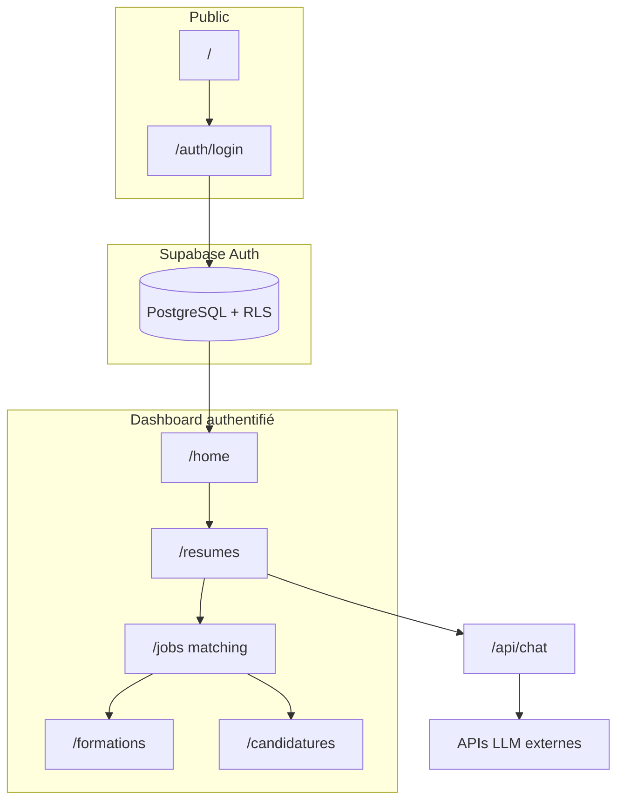

# État réel du projet — Digimytch Talent Hub (dépôt `resume-lm`)

**Version du rapport :** généré pour handoff Claude / PFE — **état factuel du code**, pas la cible CdC.  
**Référence cible (à ne pas confondre) :** `docs/CAHIER_DES_CHARGES_DIGIMYTCH_FEV2026.md`  
**Index de tous les docs :** `docs/INDEX_DOCUMENTATION.md`

---

## 1. Identité du dépôt

| Élément | Valeur réelle |
|---------|----------------|
| Nom npm | `resume-lm` v0.1.0 |
| Origine | Fork / adaptation de **ResumeLM** (constructeur de CV IA, open source) |
| Produit actif par défaut | **Digimytch Talent Hub** (PFE Digimytch) |
| Feature flag | `src/lib/digimytch-config.ts` — `isDigimytchTalentHub()` retourne **true** sauf si `NEXT_PUBLIC_DIGIMYTCH_TALENT_HUB=0` |
| Port dev configuré | **3001** (`package.json` → `next dev -p 3001`) |
| URL site locale | `NEXT_PUBLIC_SITE_URL=http://localhost:3001` (dans `.env` copié depuis `.env.example`) |

**But métier réel aujourd’hui :** permettre à un candidat de gérer un **profil + CV** (héritage ResumeLM), de **matcher** ses offres enregistrées avec son CV de base, de voir des **formations** recommandées depuis un catalogue SQL, et de **suivre des candidatures** avec statuts. Le paywall Stripe est **contourné** en mode Digimytch.

---

## 2. Stack technique (ce qui est installé et utilisé)

| Couche | Technologie | Fichiers / remarques |
|--------|-------------|----------------------|
| Framework | **Next.js 15.1.11** (App Router) | `src/app/` |
| UI | **React 19**, **TypeScript 5.x**, **Tailwind 3**, **shadcn/Radix** | `src/components/ui/` |
| Auth + DB | **Supabase** (Auth + PostgreSQL + RLS) | `src/utils/supabase/`, migrations `supabase/migrations/` |
| IA | **Vercel AI SDK** (`ai` 4.x) + providers OpenAI, Anthropic, Google, Groq, DeepSeek, OpenRouter | `src/app/api/chat/route.ts`, `src/lib/ai-models.ts`, `src/utils/ai-tools.ts` |
| Paiement (héritage) | **Stripe** (checkout embarqué, webhooks) | Toujours présent ; **désactivé côté gates** si Digimytch |
| Rate limit | **Upstash Redis** ou **ioredis** local | `src/lib/redis.ts`, `src/lib/rateLimiter.ts` |
| PDF / édition CV | **TipTap**, **@react-pdf/renderer**, html2pdf, pdf-parse, etc. | `src/components/resume/` |
| Tests | **Node.js test runner** + **tsx** (pas Jest/Vitest) | 9 fichiers `*.test.ts`, script `pnpm test` → **45 tests OK** ; `pnpm verify` = typecheck + test + lint |
| Analytics | **Vercel Analytics** (si `VERCEL=1`) ; PostHog **retiré du client** ; capture serveur PostHog **optionnelle** si clés présentes | `src/lib/analytics/server.ts` |

**Dépendances retirées du `package.json` lors de l’audit (plus dans le bundle config) :** `posthog-js`, `@next/mdx`, `gray-matter`, `next-mdx-remote`.  
**Toujours listées mais hors périmètre Digimytch :** Stripe, abonnements, essai Pro, pages subscription.

---

## 3. Arborescence utile (hors `node_modules`, `.next`)

```
resume-lm-main/
├── docs/                          # Documentation (voir INDEX_DOCUMENTATION.md)
├── docker/                        # Dockerfile + docker-compose (stack locale optionnelle)
├── public/                        # og.webp, logos (assets statiques)
├── supabase/migrations/           # 4 migrations SQL versionnées (voir §6)
├── src/
│   ├── app/                       # Routes Next.js (pages + API)
│   ├── components/                # UI métier + shadcn (~145 fichiers)
│   ├── lib/                       # Logique partagée, types, matching, Stripe, IA
│   ├── types/                     # Déclarations TS (html2pdf, next)
│   ├── utils/                     # Supabase clients, server actions
│   └── middleware.ts              # Délègue à updateSession (auth + abo)
├── .env / .env.example
├── package.json
├── next.config.ts
├── tailwind.config.ts
├── tsconfig.json
└── CLAUDE.md / .cursorrules
```

### 3.1 Ce qui a été **supprimé** du dépôt (n’existe plus)

Ces chemins **ne sont plus présents** après purge « audit » :

- `src/app/blog/**`, `content/blog/**`, `src/lib/blog.ts`, `src/components/blog/**`
- `src/app/admin/**`, `src/app/stop-impersonation/**`, `src/lib/impersonation.ts`
- `src/components/waitlist/**`, `src/components/analytics/posthog-*.tsx`
- Composants landing lourds : `pricing-section`, `creator-story`, `hero-video-section`, `model-showcase`, `how-it-works`, `VideoShowcase`, `PricingPlans`, `mock-resume*`, `benefits-list`, `action-buttons`, `buy-me-coffee.tsx`
- `src/types/mdx.d.ts`

**Conséquence :** pas de blog MDX, pas d’admin UI, pas d’impersonation, landing et login **allégés** (Hero + FeatureHighlights + FAQ).

---

## 4. Routes et pages (état réel)

### 4.1 Publiques (sans session)

| Route | Fichier | Comportement réel |
|-------|---------|-------------------|
| `/` | `src/app/page.tsx` | Landing ; si user connecté → `redirect("/home")`. Métadonnées Digimytch si flag actif. |
| `/auth/login` | `src/app/auth/login/page.tsx` | Même squelette landing + `ErrorDialog` + `AuthDialogProvider` |
| `/auth/reset-password` | `src/app/auth/reset-password/page.tsx` | Formulaire reset |
| `/auth/update-password` | `src/app/auth/update-password/page.tsx` | Mise à jour mot de passe |
| `/auth/callback` | `src/app/auth/callback/route.ts` | OAuth / magic link Supabase |
| `/auth/confirm` | `src/app/auth/confirm/route.ts` | Confirmation email |

Middleware : seules `/` et `/auth/*` sont accessibles sans login (`src/utils/supabase/middleware.ts`).

### 4.2 Protégées (session requise)

| Route | Fichier | Rôle réel |
|-------|---------|-----------|
| `/home` | `src/app/(dashboard)/home/page.tsx` | Dashboard : profil, CV base / sur mesure, cartes Digimytch (`TalentHubHomeCards`) |
| `/profile` | `src/app/(dashboard)/profile/page.tsx` | Profil utilisateur (données type ResumeLM) |
| `/resumes` | `src/app/(dashboard)/resumes/page.tsx` | Liste des CV |
| `/resumes/[id]` | `src/app/(dashboard)/resumes/[id]/page.tsx` | Éditeur CV complet (TipTap, assistant IA, score, etc.) |
| `/jobs` | `src/app/(dashboard)/jobs/page.tsx` | **Matching** : scores 0–100, listes mots-clés / écarts, bouton candidature |
| `/formations` | `src/app/(dashboard)/formations/page.tsx` | Catalogue + top recommandations (`rankCoursesBySkillGaps`) |
| `/candidatures` | `src/app/(dashboard)/candidatures/page.tsx` | Tableau candidatures + changement statut / suppression |
| `/settings` | `src/app/(dashboard)/settings/page.tsx` | Compte, clés API, abonnement (UI encore là) |
| `/subscription/*` | `src/app/(dashboard)/subscription/**` | Stripe checkout (inactif comme gate en mode Digimytch) |
| `/start-trial` | `src/app/(dashboard)/start-trial/page.tsx` | Essai (héritage ResumeLM) |

### 4.3 API

| Route | Fichier | Rôle |
|-------|---------|------|
| `POST /api/chat` | `src/app/api/chat/route.ts` | Streaming assistant IA sur le CV (tools, quotas, ledger) |
| `POST /api/webhooks/stripe` | `src/app/api/webhooks/stripe/route.ts` | Webhooks Stripe + idempotence table `stripe_webhook_events` |
| `GET /subscription/checkout-return` | `src/app/(dashboard)/subscription/checkout-return/route.ts` | Retour checkout Stripe |

---

## 5. Flux applicatif (relations entre modules)



### 5.1 Mode Digimytch (`isDigimytchTalentHub() === true`)

| Zone | Comportement |
|------|----------------|
| `src/utils/supabase/middleware.ts` | Pas de redirection paywall ; utilisateur connecté accède à toutes les routes protégées |
| `src/utils/actions/stripe/actions.ts` | `getSubscriptionPlan` force effet « pro » / pas de blocage quota CV (via `assertResumeQuota` dans resumes actions) |
| `src/app/layout.tsx` | `showUpgradeButton = false`, `isProPlan = true` pour header |
| Navigation | `TalentHubNav` / `TalentHubMobileNav` : Accueil, CV, Matching, Formations, Candidatures |
| Métadonnées | `src/lib/app-metadata.ts` — titre « Digimytch Talent Hub » |

### 5.2 Mode ResumeLM (`NEXT_PUBLIC_DIGIMYTCH_TALENT_HUB=0`)

Réactivation du contrôle d’abonnement Stripe dans le middleware, branding et paywall d’origine (non testé en profondeur dans ce rapport).

---

## 6. Base de données (migrations présentes dans le repo)

**Important :** le schéma **profiles / resumes / jobs / subscriptions** n’a **pas** de fichier `CREATE TABLE` dans ce dépôt ; il est supposé hérité de ResumeLM / Supabase existant. Seules les migrations suivantes sont **versionnées ici** :

| Fichier | Contenu réel |
|---------|----------------|
| `20260215120000_digimytch_courses_applications.sql` | Tables `courses`, `job_applications`, `job_application_events` ; RLS ; trigger `updated_at` ; **seed** catalogue formations (idempotent) |
| `202605030002_create_ai_usage_events.sql` | Journal usage IA |
| `20260503022114_create_stripe_webhook_events.sql` | Idempotence webhooks |
| `20260503022343_secure_stripe_webhook_events_rls.sql` | RLS webhook events |

### 6.1 Tables Digimytch (définies dans le repo)

**`courses`** — lecture pour tout `authenticated` ; pas d’UI admin pour CRUD catalogue.

**`job_applications`** — une ligne par `(user_id, job_id)` ; statuts : `saved | applied | interview | rejected | accepted`.

**`job_application_events`** — historique des changements de statut (insert côté server actions).

### 6.2 Modèle mental JSON (héritage ResumeLM)

Documenté dans `.cursorrules` / `CLAUDE.md` : `profiles` et `resumes` stockent `work_experience`, `education`, `skills`, `projects`, `section_configs`, etc. en **JSONB**.

Types TypeScript : `src/lib/types.ts` (`Resume`, `Job`, `Course`, `JobApplication`, `JobMatchResult`, …).

---

## 7. Logique métier Digimytch (fichiers clés)

| Fichier | Rôle |
|---------|------|
| `src/lib/matching.ts` | Score 0–100 : tokenisation CV (skills, exp, projets) vs mots-clés offre + titre ; retourne `matchedKeywords`, `missingKeywords`, `matchedSkills`, `gapSkills` |
| `src/lib/matching.test.ts` | Tests unitaires matching |
| `src/lib/course-ranking.ts` | `rankCoursesBySkillGaps(courses, gaps)` — score de recouvrement textuel (hors `"use server"`) |
| `src/utils/actions/digimytch/actions.ts` | `getJobsWithMatchScores`, `getFormationHubData` |
| `src/utils/actions/courses/actions.ts` | `listCourses()` seulement (`"use server"`) |
| `src/utils/actions/applications/actions.ts` | `listJobApplications`, `createJobApplication`, `updateJobApplicationStatus`, `deleteJobApplication`, `listApplicationEvents` |
| `src/app/(dashboard)/jobs/actions.ts` | `trackJobApplicationAction` — créer candidature depuis page matching |

**Matching :** 100 % **règles serveur** sur `/jobs` — pas d’appel LLM pour expliquer le score sur cette page.

**Formations :** recommandations = intersection textuelle `skills_targeted` du cours vs union des `gapSkills` des 8 premières offres matchées.

---

## 8. Authentification et sécurité (réel)

- **Supabase Auth** : email/mot de passe + GitHub (`AuthDialog`, `login-form`, `signup-form`).
- **Middleware** : `auth.getUser()` sur presque toutes les routes ; cookies SSR via `@supabase/ssr`.
- **RLS** : policies sur tables Digimytch dans migration ; tables legacy supposées déjà protégées par user_id.
- **Sans Supabase joignable** : erreurs client (« Hide Errors » possible), pas de login fonctionnel.

Compte seed documenté dans `.env.example` (si stack Docker seed) : `SEED_ADMIN_EMAIL` / `SEED_ADMIN_PASSWORD` — dépend du setup Docker, pas garanti sans `docker compose`.

---

## 9. IA (héritage ResumeLM, toujours actif)

| Élément | Détail |
|---------|--------|
| Endpoint | `POST /api/chat` |
| Contrôle d’accès | `src/lib/ai/access-control.ts` — modèles free vs pro, BYOK |
| Quotas / ledger | `src/lib/ai/usage-ledger.ts`, table `ai_usage_events` |
| Prompts | `src/lib/prompts.ts`, prompts personnalisables dans settings |
| Tools | `src/lib/tools.ts` — modifications structurées du CV |

**Prérequis runtime :** au moins une clé API IA dans `.env` pour l’assistant ; sinon alertes dans le dashboard (`ApiKeyAlert`).

---

## 10. Paiement Stripe (présent mais neutralisé en Digimytch)

Fichiers toujours là : `stripe-session.tsx`, `checkout-form.tsx`, webhooks, `subscription-access.ts`, pages `/subscription`.

En mode Digimytch : middleware **ne bloque pas** ; layout traite l’utilisateur comme Pro.

`src/lib/stripe-server.ts` : client Stripe **lazy** (build Next possible sans `STRIPE_SECRET_KEY` au chargement du module).

---

## 11. Tests automatisés (état réel)

| Fichier | Sujet |
|---------|--------|
| `src/lib/matching.test.ts` | Algorithme matching + `formatResumeDate` |
| `src/lib/course-ranking.test.ts` | Recommandations formations |
| `src/lib/analytics/events.test.ts` | Sanitization analytics |
| `src/lib/subscription-access.test.ts` | Droits abonnement |
| `src/lib/stripe/*.test.ts` | Sync abonnement, checkout guard |
| `src/lib/ai/*.test.ts` | Accès IA, usage ledger |
| `src/utils/actions/stripe/actions.safety.test.ts` | Pas de toggle plan dangereux |

**Pas de :** tests E2E Playwright/Cypress dans le dépôt.

**Dernière exécution documentée :** `pnpm verify` → 45 passed, lint OK ; `next build` OK ; `tsc` OK.

---

## 12. UI / contenu — incohérences réelles (pas idéal CdC)

| Zone | État constaté |
|------|----------------|
| Landing `Hero.tsx`, `FAQ.tsx` | **FR** (Digimytch Talent Hub) — cohérent PFE |
| Footer / logo | **Digimytch** en mode flag actif |
| Nav publique `nav-links.tsx` | Liens **Fonctionnalités** / **FAQ** (FR) |
| Page `/jobs`, `/formations`, `/candidatures` | UI **française**, alignée PFE |
| Admin catalogue formations | **Absent** — seed SQL uniquement |
| Historique candidatures (timeline) | **`ApplicationHistory`** sur chaque carte `/candidatures` |
| Notes sur candidature | Champ `notes` en base ; édition limitée / pas d’UI dédiée riche |

---

## 13. Configuration et démarrage local (état réel)

1. Copier `.env.example` → `.env`.
2. `npx pnpm@9 install` (pnpm non requis en global).
3. Démarrer **Supabase** sur `http://localhost:54321` (Docker `docker/docker-compose.yml` ou CLI).
4. Appliquer migrations : `supabase db push` ou équivalent.
5. `npx pnpm@9 dev` → **http://localhost:3001**.

**Variables critiques :**

- `NEXT_PUBLIC_SUPABASE_URL`, `NEXT_PUBLIC_SUPABASE_ANON_KEY`, `SUPABASE_SERVICE_ROLE_KEY`
- `NEXT_PUBLIC_SITE_URL` (doit correspondre au port, ex. 3001)
- IA : `OPENAI_API_KEY` et/ou autres (optionnel pour parcours sans chat)
- Redis : `USE_LOCAL_REDIS=true` + `REDIS_URL` ou Upstash
- Stripe : optionnel en Digimytch pour gates ; requis si mode ResumeLM + checkout

---

## 14. Ce qui manque **réellement** (écarts factuels, pas roadmap CdC)

| Manque | Détail |
|--------|--------|
| Schéma SQL complet dans le repo | Tables `profiles`, `resumes`, `jobs` non créées par migrations locales visibles |
| UI admin formations | Pas de CRUD ; catalogue = seed migration |
| Texte explicatif IA du matching | **`JobMatchExplain`** sur `/jobs` (nécessite clé API) |
| Tests d’intégration / E2E | Absents |
| Blog, admin, impersonation, waitlist | Supprimés volontairement |
| Homogénéité FR/EN | Landing/login mixtes |
| `react-scan` dans package.json | Dépendance listée ; usage non central au produit |
| Parcours sans Supabase | Application non utilisable (auth bloquante) |

---

## 15. Cartographie `src/` — fichiers par responsabilité

### 15.1 `src/app/` (31 fichiers TS/TSX routes)

Voir §4 ; groupe `(dashboard)` = layout partagé avec header/footer (`src/app/layout.tsx`).

### 15.2 `src/components/` (groupes principaux)

| Dossier | Rôle |
|---------|------|
| `digimytch/` | `talent-hub-nav.tsx`, `talent-hub-home-cards.tsx` |
| `resume/` | Éditeur, management, PDF, assistant |
| `auth/` | Dialog, forms, provider |
| `dashboard/` | Home widgets |
| `landing/` | `Hero`, `FAQ`, `FeatureHighlights`, `Background` |
| `layout/` | `app-header`, `footer`, `nav-links`, `page-title` |
| `settings/` | Paramètres compte |
| `subscription/`, `pricing/`, `trial/` | Monétisation héritée |
| `ui/` | Design system shadcn |
| `jobs/` | `job-listings-card.tsx` (composant jobs legacy) |

### 15.3 `src/lib/` (32 fichiers)

Cœur : `types.ts`, `matching.ts`, `digimytch-config.ts`, `prompts.ts`, `schemas.ts`, `subscription-access.ts`, `resume-limits.ts`, `stripe-server.ts`, `course-ranking.ts`, `app-metadata.ts`, sous-dossiers `ai/`, `stripe/`, `analytics/`.

### 15.4 `src/utils/` (23 fichiers)

- `supabase/` : `client.ts`, `server.ts`, `middleware.ts`
- `actions/` : `profiles`, `resumes`, `jobs`, `cover-letter`, `stripe`, `subscriptions`, `courses`, `applications`, `digimytch`
- `actions.ts` : agrégat dashboard (`getDashboardData`)
- `ai-tools.ts`, `auth.ts`, `auth-cache.ts`

---

## 16. Relation avec les autres documents `.md`

| Besoin | Document |
|--------|----------|
| **État actuel (ce fichier)** | `ETAT_REEL_DU_PROJET.md` |
| Exigences métier cible | `CAHIER_DES_CHARGES_DIGIMYTCH_FEV2026.md` |
| Checklist implémentation | `IMPLEMENTATION_DIGIMYTCH_STEPS.md` |
| Contexte oral / rapport | `PFE_CONTEXTE_ET_INSTRUCTIONS.md` |
| Guide dev générique ResumeLM | `CLAUDE.md` (racine) |

---

## 17. Résumé une phrase pour Claude

**Ce dépôt est une application Next.js 15 + Supabase, dérivée de ResumeLM, configurée par défaut en « Digimytch Talent Hub » : CV et IA existants, plus trois pages MVP (matching par règles, formations par catalogue SQL, candidatures avec statuts), paywall Stripe désactivé en middleware, documentation PFE séparée du code, et plusieurs finitions UI/i18n ou admin encore absentes malgré des briques backend prêtes (ex. events candidatures).**
